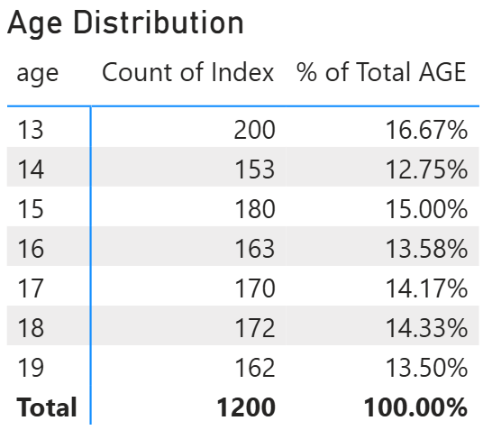
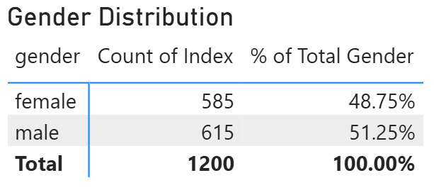
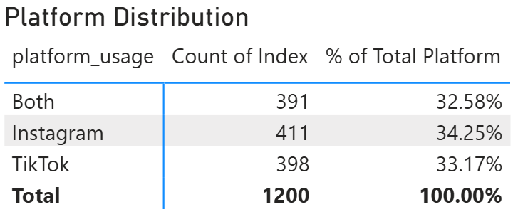
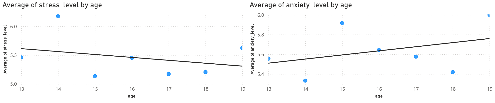
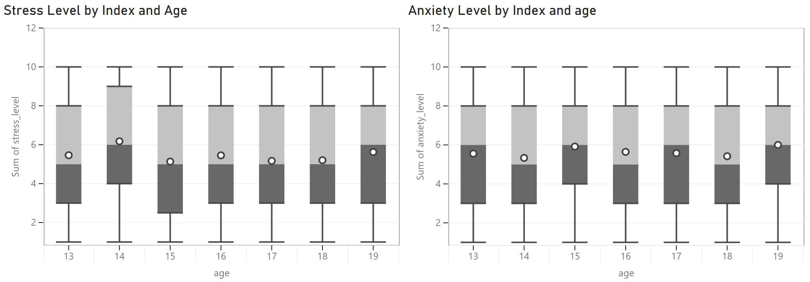
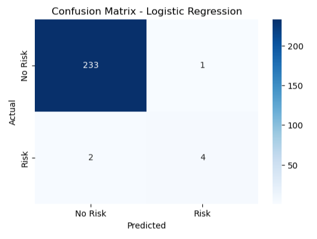
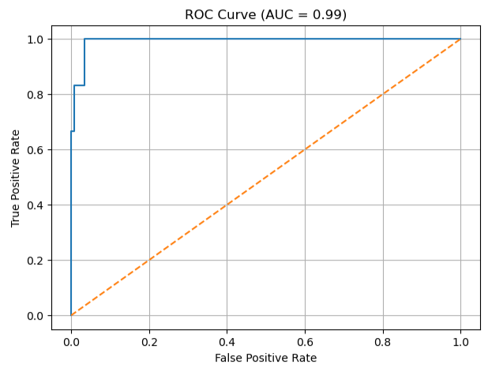

# Tean Mental Health Data Analysis - Building a Logistic Regression Model to predict if they will develop depression.
The purpose of this data project is to build a model using this data to predict if a teenager is in danger of developing depression. 

## Data used in this model.
There are multiple data points used in producing this model, these cover the students age, gender, daily social media hours, platform usage (Instagram, TikTok, Both), sleep hours, screen time before sleep, academic performance (using USA GPA System), physical activity, social interaction level, stress level, anxiety level, addiction level and depression label (do they have depression Yes/No).

## Data Distribution
First we want to under the distribution of the data making sure that all ages and groups are represented equally. Having a data set where one dynamic is favoured over the other could cause internal biases when building the model.

### Age Distribution

An average split across the 7 ages would be 171 agents, the groups furthest away from this is 14 year olds -18 below the average and 13 year olds +29 above the average.

### Gender Distribution

Ideally a straight 50/50 split would be preferred, in this data set there is a +15 (1.25%) in favour of males.

### Platform Distribution

This shows the split between the social media platform used, Instagram, or Ticktock, or if they use both. 400 should be the average on a 33.3%, currently we have a 32%, 33%  and 34% across the 3 profiles.

From analysing the data above we can see that while there are some anachronisms between the data the split amongst the groups as is close to even as can realistically be expected, this gives confidence in using the data to build an exact model.

### Average of Stress and Anxiety by Age

These tables were designed to present the average Stress and Anxiety level for each age group, you can see as the age goes up Stress decreased but Anxiety increases.

The American Psychological Association describes the difference between stress and anxiety using this phrase "People under stress experience mental and physical symptoms, such as irritability, anger, fatigue, muscle pain, digestive troubles, and difficulty sleeping.
Anxiety, on the other hand, is defined by persistent, excessive worries that don’t go away even in the absence of a stressor. Anxiety leads to a nearly identical set of symptoms as stress: insomnia, difficulty concentrating, fatigue, muscle tension, and irritability."

As the teenagers become more experienced, they stop being affected by issues that would cause stress but instead they end up having to focus on other issues that they cannot control. E.g. Less time time to sped with friends due to I or Family commitments, concerns for Rent, Food, cost of Energy.

## Model Results
Initial Results when testing the model are excellent. The data source has a total of 1200 students in the data set so testing on 20% gives us a testing pool of 240 people.
The models accuracy shows at 0.9875 and the ROC-AUC shows as 0.9929 indicating an excellent outcome for helping the teenagers.
The Confusion Matrix below show of the 240 students tested 233 were predicted and completed as at no risk of depression.

You can see from the ROC (Receiver Operator Characteristic) curve shows almost a perfect classification with almost no errors and the . 
