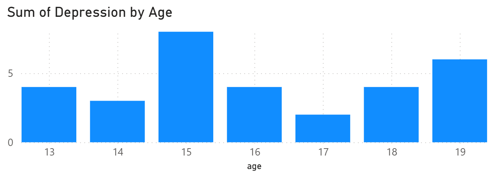
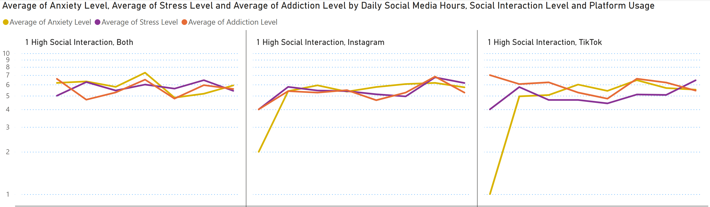
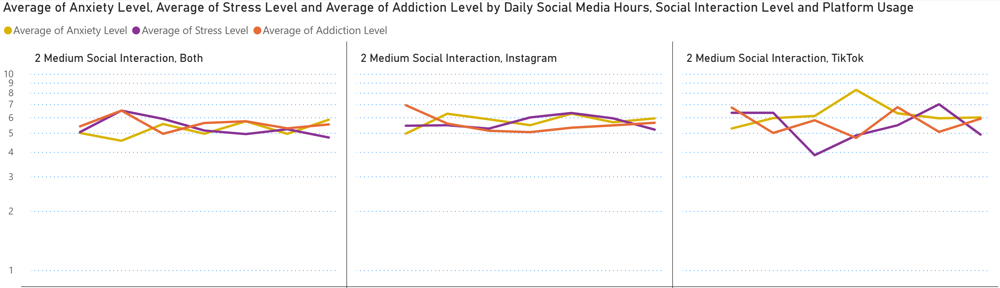
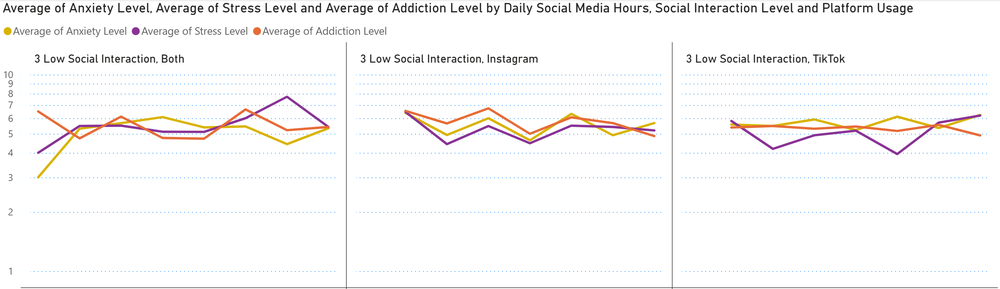

# Tean Mental Health Data Analysis
This data source contains the records of 1200 Teenagers.
The Columns within the data set are:

Age,	Gender, Daily Social Media Hours,	Platform Usage,	Sleep Hours,	Screen Time Before Sleep,	Academic Performance,	Physical Activity,	Social Interaction Level,	Stress Level,	Anxiety Level,	Addiction level,	Depression Label

## Data Distribution
### Age Distribution

An average split across the 7 ages would be 171 agents, the groups furthest away from this is 14 year olds -18 below the average and 13 year olds +29 above the average.

### Gender Distribution

Ideally a straight 50/50 split would be preferred, in this data set there is a +15 (1.25%) in favour of males.

### Platform Distrubtion

This shows the split between the social media platfrom used, Instagram, or Ticktock, or if they use both. 400 should be the average on a 33.3%, currently we have a 32%, 33%  and 34% across the 3 profiles.

We can see from these distributions that despite some irregurlarities the dataset contains a good split across the different metrics for social media use, gender, and age.

### Average of Stress and Anxiety by Age

### Stress and Anxiety Boxplot

### Total people with depression and percentage of the total.

This Graph shows the total number of agents who have been diagnosed with depression and what percentage they represent of the total number of agents who are that age.

### Average of Anxiety, Stress Level and Addiction Level by Age, Social Interaction and Platform

